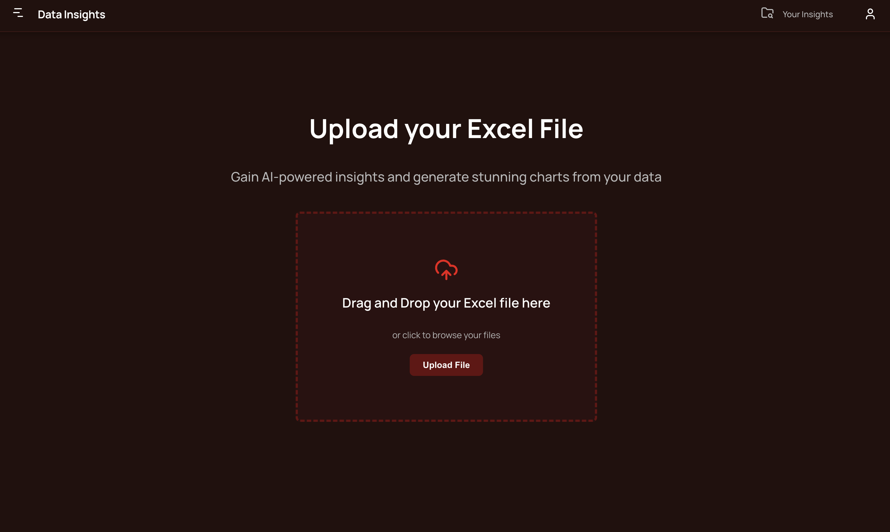
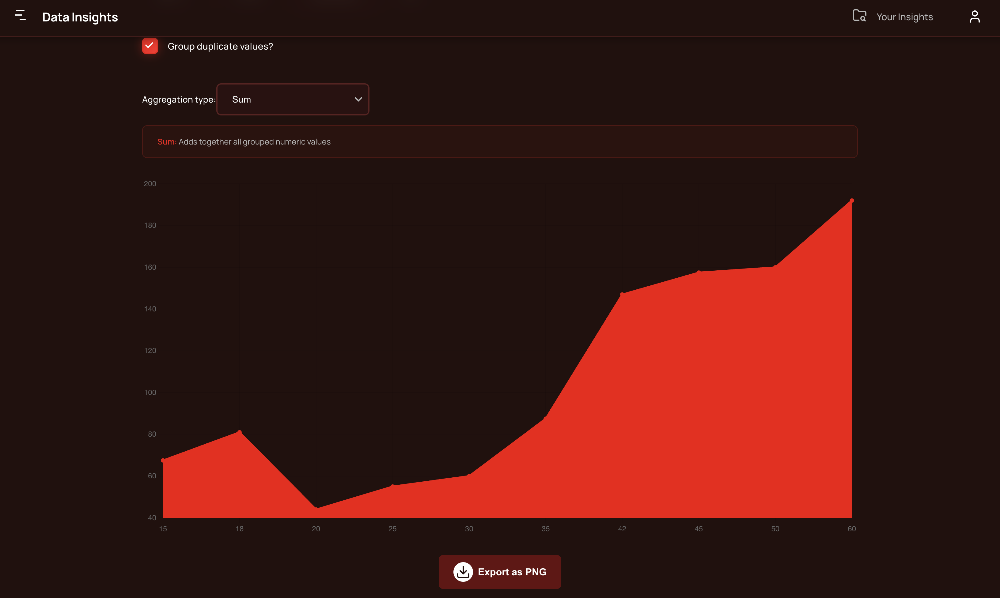

Sheet Vision is a web application built with Angular and Chart.js that transforms Excel files into interactive dashboards.
It allows users to upload, parse, and visualize spreadsheet data in dynamic charts — turning static sheets into insights.

⚠️ Note: Make sure to use numeric columns in your Excel files, as Sheet Vision generates numeric-based charts (Bar, Line, Area, Doughnut).

 Features
	•	 Upload .xlsx or .xls files
	•	 Automatic header and data detection
	•	 Generate charts dynamically (Bar, Line, Area, Doughnut)
	•	 Data normalization & aggregation
	•	 Future-ready for AI-powered insights

 Tech Stack
	•	Frontend: Angular 20, TypeScript, SCSS
	•	Charts: Chart.js
	•	Build Tools: Vite, pnpm
	•	Design: Tailwind-inspired UI principles

 Live Demo
 https://sheet-vision-app.vercel.app/
 
<table>
  <tr>
    <td> Dashboard View</td>
    <td> Dashboard View</td>
  </tr>
  <tr>
    <td> Dashboard View</td>
    <td> Dashboard View</td>
  </tr>
</table>

https://sheet-vision-app.vercel.app/

