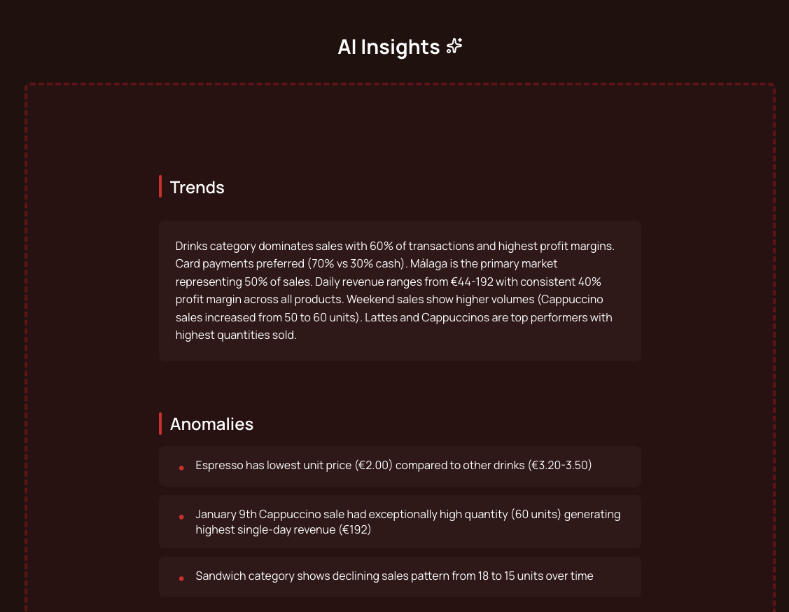
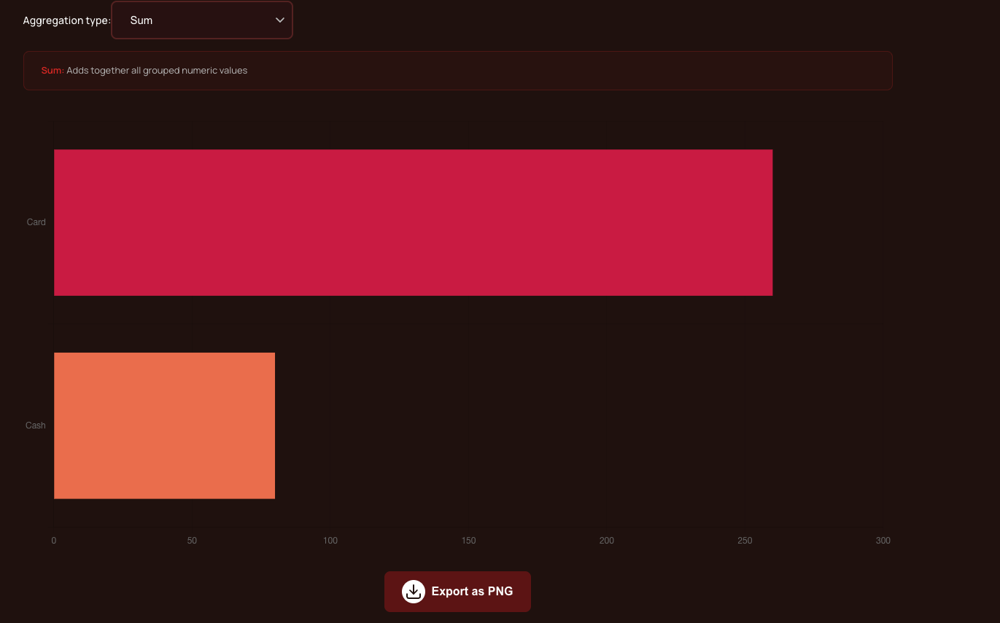
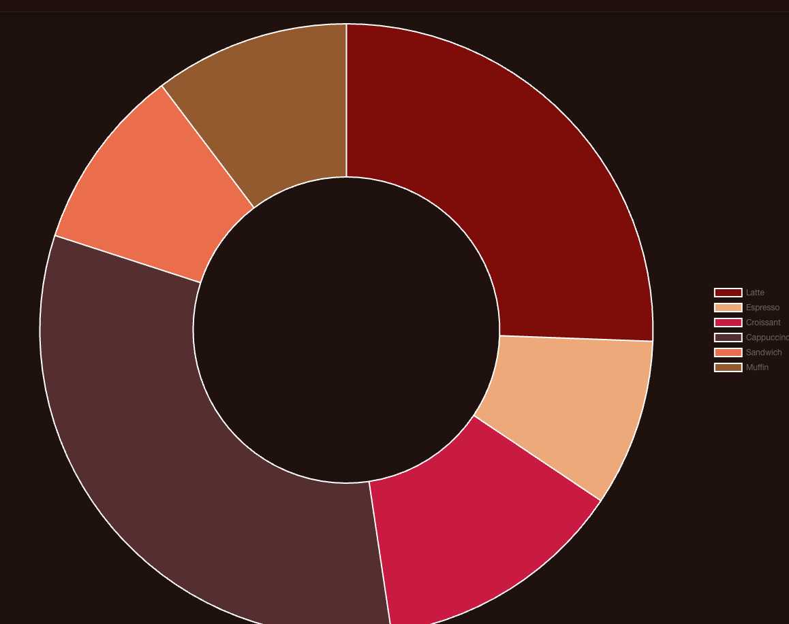

Sheet Vision is a web application built with Angular and Chart.js that transforms Excel files into interactive dashboards.
It allows users to upload, parse, and visualize spreadsheet data in dynamic charts — turning static sheets into insights.

⚠️ Note: Make sure to use numeric columns in your Excel files, as Sheet Vision generates numeric-based charts (Bar, Line, Area, Doughnut).

 <h2>Features</h2>
 <ul>
   <li>Upload Excel files (.xlsx, .xls)</li>
   <li>Create interactive charts (Bar, Line, Area, Doughnut)</li>
   <li>Get AI insights - trends, anomalies, recommendations</li>
   <li>Data aggregation (Sum, Average, Count)</li>
   <li>Responsive design</li>
   
 </ul>

 <h2>Tech Stack</h2>
 <ul>
    <li>Frontend: Angular 20, TypeScript, SCSS, Chart.js</li>
    <li>Backend: Spring Boot, Java, Docker, Anthropic Claude API, SheetJS</li>
    <li>Deployment: Vercel (frontend), Railway (backend)</li>
 </ul>

 <h2>How to use - Quick Start</h2>

<h3>Frontend</h3>

git clone https://github.com/jawinga/sheet-vision-app.git

cd sheet-vision-app

npm install

ng serve

<h3>Backend</h3>

git clone https://github.com/jawinga/sheetvision.api.git

cd sheetvision.api

export ANTHROPIC_API_KEY=your_key_here

mvn spring-boot:run

  
  
  <h2>Next steps</h2>
  <ul>
    <li>Hybrid parsing: frontend preview and in-depth APACHE POI parsing</li>
    <li>Sanitise/normalise cells and return new file</li>
  </ul>
  
 <h2>Live Demo</h2>
 https://sheet-vision-app.vercel.app/
 
<table>
  <tr>
    <td> Dashboard View</td>
    <td> Dashboard View</td>
  </tr>
  <tr>
    <td> Dashboard View</td>
    <td> Dashboard View</td>
  </tr>
  <tr>
    <td> Dashboard View</td>
    <td> Dashboard View</td>
  </tr>
  <tr>
    <td> Dashboard View</td>
  </tr>
</table>

https://sheet-vision-app.vercel.app/

